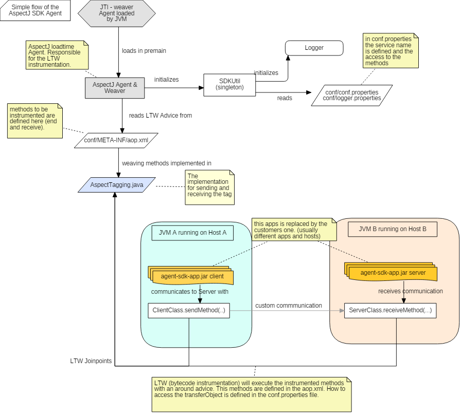

> **DISCLAIMER**: This project was developed as part of a research and is not complete, nor supported and only intended as research of a generic implementation with the OneAgent SDK.

# AspectJ SDK based on OneAgent SDK for Java #

This small AspectJ agent allows Dynatrace customers to bring visibility in the communication between java processes with custom protocols or custom frameworks which are not supported out-of-the-box by Dynatrace.

This custom instrumentation is made via configuration without the need of having access to the source code of the application. This agent is based in [Aspectj](https://www.eclipse.org/aspectj) and uses the implementation of the [Dynatrace OneAgent SDK for Java](https://github.com/Dynatrace/OneAgent-SDK-for-Java). 

## Motivation ##
It is not always possible to access the code of an application, nor necessary in order to complete the tracing between two different components (e.g. client-server) of a transaction. This agent achieves tagging transactions between a client -> server communications via configuration. 

## Getting started ##
These instructions will get you a copy of the project up and running on a windows or linux machine.

### Prerequisites ###
* Java 6 or above: [Download Java](https://java.com/de/download/)
* Maven 3 or above: [Download mvn](https://maven.apache.org/download.cgi)
* Dynatrace Tenant and Dynatrace OneAgent running on the host: [Get your Saas Trial Tenant](https://www.dynatrace.com/trial/)
* GIT (optional: you can download the project from the browser) [Download GIT](https://git-scm.com/downloads)

> Hint: If you want just to run the program without compiling it nor modifying the sourcode, there is a .zip file under the directory "distribution". You only need a JRE 1.6+ and the OneAgent running on the host. To do this, go to the section on how to run sample application.

### Installing ###

For getting the project up and running on your machine you only need to clone the git repository. There is a directory called *distribution* with the latest compiled version of the aspect agent and a sample client-server app. 

#### Download the repository ###

	git clone https://github.com/Dynatrace/OneAgent-SDK-AspectJ

## Understanding & runnig the project ##

### Compile the code ###
Compiling the code is quite easy. Just run the maven (clean & install) command from the project base you want to compile, either the app or the agent or by running this comand on the parent directory you'll build both projects. 

    mvn clean install

The first time will take a little time to build, since the maven dependencies needed to build and package the program will be downloaded. The project uses as few dependencies as possible so the monitoring jar (agent) is as lightweight as possible. The only dependencies are **com.dynatrace.oneagent.sdk.java:oneagent-sdk** and **org.aspectj:aspectjweaver**. This dependencies will be unpacked and packed inside the aspect-sdk-agent.jar so the classpath for the agent does not need to be defined when instrumenting an application.

### Project structure & description ###

The project has a simple structure. 

**Overview**

	└── aspect-sdk					Main Project directory
	    ├── aspect-sdk-agent			The aspectj agent with the SDK implementation.
	    ├── aspect-sdk-app				Simple client-server app. It has no dependency to the SDK agent.
	    ├── distribution				Folder including a ZIP file for running the client-server app with the aspect sdk agent.
	    ├── uml 					UML documentation
	    ├── pom.xml					Maven build for the project.
	    ├── LICENSE					License file.
	    └── README.md				This readme file.

**The aspectj sdk agent**

	└─ aspect-sdk-agent								 
	   ├── conf										
	   │   ├── config.properties			Configuration for the agent like service name, arguments to capture, deep access..
	   │   └── logger.properties			Log configuration
	   │    			
	   ├── pom.xml					maven build configuration for the agent (including also the distribution)
	   ├── src
	   │   ├── assembly
	   │   │   ├── client.[bat/sh]			batch/shell skript for calling the client application with the SDK agent
	   │   │   ├── server.[bat/sh]			batch/shell skript for calling the server application with the SDK agent
	   │   │   └── distribution.xml			file for creating the release in a ZIP file. See distribution directory
	   │   ├── de
	   │   │   └── dynatrace
	   │   │       └── aspectj
	   │   │           ├── util
	   │   │           │   └── SDKUtil.java 	Util Class (Singleton). Reads the properties and inits the Log. Also initializes the oneAgentSdk.
	   │   │           │   
	   │   │           └── AspectTagging.java	The actual AspectJ Weaving Class instrumenting the methods and setting the tags. The Methods to be monitored are declared in the aop.xml
	   │   │       
	   │   │       
	   │   │       
	   │   └── main
	   │       └── resources
	   │           └── META-INF
	   │               ├── aop.xml			AspectJ Configuration for Load Time Weaving. (In the distribution this file will be copied in the conf directory!) 
	   │               └── MANIFEST.MF		Manifest file declaring the premain Class, the AOP.xml file and the instrumentation agent
	   │   
	   │       
	   └── weaver
	       ├── aspectjweaver-1.8.10.jar		The aspectjweaver archive. Used only for development purpouses for running the app within eclipse. 
	       └── README				The description on how to use the above library on runtime with eclipse.

**The sample application**

	└── aspect-sdk-app
	    ├── pom.xml						Maven build configuration
	    └── src.de.dynatrace.sample.uriservice
	        ├── Client.java					Client implementation, calls an URI then calls the server with hostname and port.
	        ├── Main.java					Main Class. The first argument decides either to start the client or server.
	        ├── Server.java					Server implementation. Opens a port and listens to incoming connections.
	        ├── TransferObject.java				A transfer Object Class for showing deep access implementation.
	        └── URIService.java				Helper class for calling URL's.

## Implementation strategy ##

## Program's logic/flow ##

## Who do I talk to? ##

If this project gave you some new ideas or might help you or your customers, then that's awesome! If you think we can be of any help, don't hesitate to reach out!

* You can always reach out to me [sergio.hinojosa@dynatrace.com](mailto:sergio.hinojosa@dynatrace.com) or to my team in [dach.se@dynatrace.com](mailto:dach.se@dynatrace.com)
